# Дипломный практикум в YandexCloud

* [Цели:](#цели)
* [Этапы выполнения:](#этапы-выполнения)
    * [Регистрация доменного имени](#регистрация-доменного-имени)
    * [Создание инфраструктуры](#создание-инфраструктуры)
        * [Установка Nginx и LetsEncrypt](#установка-nginx)
        * [Установка кластера MySQL](#установка-mysql)
        * [Установка WordPress](#установка-wordpress)
        * [Установка Gitlab CE, Gitlab Runner и настройка CI/CD](#установка-gitlab)
        * [Установка Prometheus, Alert Manager, Node Exporter и Grafana](#установка-prometheus)
* [Что необходимо для сдачи задания?](#что-необходимо-для-сдачи-задания)

---

## Цели:

>1. Зарегистрировать доменное имя (любое на ваш выбор в любой доменной зоне).
>2. Подготовить инфраструктуру с помощью Terraform на базе облачного провайдера YandexCloud.
>3. Настроить внешний Reverse Proxy на основе Nginx и LetsEncrypt.
>4. Настроить кластер MySQL.
>5. Установить WordPress.
>6. Развернуть Gitlab CE и Gitlab Runner.
>7. Настроить CI/CD для автоматического развёртывания приложения.
>8. Настроить мониторинг инфраструктуры с помощью стека: Prometheus, Alert Manager и Grafana.

---

### Часть 1. Регистрация доменного имени

> Подойдет любое доменное имя на ваш выбор в любой доменной зоне.
>
>ПРИМЕЧАНИЕ: Далее в качестве примера используется домен `you.domain` замените его вашим доменом.
>
>Рекомендуемые регистраторы:
>
>- [nic.ru](https://nic.ru)
>- [reg.ru](https://reg.ru)
>
>Цель:
>
>1. Получить возможность выписывать [TLS сертификаты](https://letsencrypt.org) для веб-сервера.
>
>Ожидаемые результаты:
>
>1. У вас есть доступ к личному кабинету на сайте регистратора.
>2. Вы зарегистрировали домен и можете им управлять (редактировать dns записи в рамках этого домена).

### Решение

* Зарегестрирован домен dsolokhin.ru и деллегирован в яндекс.

---

## Часть 2. Создание инфраструктуры

> Для начала необходимо подготовить инфраструктуру в YC при помощи [Terraform](https://www.terraform.io/).
>
>Особенности выполнения:
>
>- Бюджет купона ограничен, что следует иметь в виду при проектировании инфраструктуры и использовании ресурсов;
>- Следует использовать последнюю стабильную версию [Terraform](https://www.terraform.io/).

### Подготовка:

0. **Yandex.Cloud**

Инсталлируем Yandex.Cloud CLI и проверим версию:

```bash
$ curl https://storage.yandexcloud.net/yandexcloud-yc/install.sh | bash
$ yc --version
Yandex Cloud CLI 0.91.0 linux/amd64
```

* Инициализируем профиль `yc init`
* Авторизуемся используя OAuth token
* В процессе инита создадим новый фолдер `diplom-ds`

----

> 1. Создайте сервисный аккаунт, который будет в дальнейшем использоваться Terraform для работы с инфраструктурой с
     > необходимыми и достаточными правами. Не стоит использовать права суперпользователя

### Создадим сервисный аккаунт `service-account`

```bash
$ yc iam service-account create --name service-account
----------аутпут----------
id: aje3laac53hf2ult7moa
folder_id: b1gem3u5mv0e4k9vjcif
created_at: "2022-10-05T14:55:09.679880926Z"
name: service-account


```

### Выдадим роль editor сервисному аккаунту

```bash
$ yc resource-manager folder add-access-binding diplom-ds \
> --role editor \
> --subject serviceAccount:aje3laac53hf2ult7moa
done (2s)
```

### Создадим ключ авторизации для сервисного аккаунта `service-account`

```bash
$ yc iam access-key create --folder-name diplom-ds --service-account-name service-account
----------аутпут----------
access_key:
  id: ajemt5iljka1kasqhd5q
  service_account_id: aje3laac53hf2ult7moa
  created_at: "2022-10-05T14:57:17.834141610Z"
  key_id: YCAJEvAfzaLJB7EHIDoLA834v
secret: YCMwAkVLDf-FOJtvsDmkXbwyvbiUTRlZYU6lP0iG

```

### Создадим ключ доступа для сервисного аккаунта `service-account`

```bash
$ yc iam key create --folder-name diplom-ds --service-account-name service-account --output key.json
----------аутпут----------
account-name service-account --output key.json
id: ajeoia88d0ipljto1aog
service_account_id: aje3laac53hf2ult7moa
created_at: "2022-10-05T14:57:56.074095781Z"
key_algorithm: RSA_2048
```

----

> 2. Подготовьте [backend](https://www.terraform.io/docs/language/settings/backends/index.html) для Terraform:\
         > Используем альтернативный вариант: S3 bucket в созданном YC аккаунте.


1. Создадим бакет `my-tf-diplom-ds`  через поддерживаемый облаком `aws`

```bash
$ aws configure
AWS Access Key ID: **********
AWS Secret Access Key: ***********
Default region name [ru-central1]: ru-central1
Default output format [table]: table

$ ycs3 mb s3://my-tf-diplom-ds
make_bucket: my-tf-diplom-ds
```

### Инициализируем бекенд сохранив первое состояние в s3

1. Подготовим `provider.tf` и `variables.tf`
2. Инициализируем терраформ запустив `init` и `apply` из директории [stage](terraform/stage)

```bash
$ terraform init

Initializing the backend...

Successfully configured the backend "s3"! Terraform will automatically
use this backend unless the backend configuration changes.

Initializing provider plugins...
- Finding latest version of yandex-cloud/yandex...
- Installing yandex-cloud/yandex v0.76.0...
- Installed yandex-cloud/yandex v0.76.0 (unauthenticated)

Terraform has created a lock file .terraform.lock.hcl to record the provider
selections it made above. Include this file in your version control repository
so that Terraform can guarantee to make the same selections by default when
you run "terraform init" in the future.

Terraform has been successfully initialized!

You may now begin working with Terraform. Try running "terraform plan" to see
any changes that are required for your infrastructure. All Terraform commands
should now work.

If you ever set or change modules or backend configuration for Terraform,
rerun this command to reinitialize your working directory. If you forget, other
commands will detect it and remind you to do so if necessary.

$ terraform plan

No changes. Your infrastructure matches the configuration.

Terraform has compared your real infrastructure against your configuration and found
no differences, so no changes are needed.
$ terraform apply

No changes. Your infrastructure matches the configuration.

Terraform has compared your real infrastructure against your configuration and found
no differences, so no changes are needed.

Apply complete! Resources: 0 added, 0 changed, 0 destroyed.
```

----
> 3. Настройте [workspaces](https://www.terraform.io/docs/language/state/workspaces.html)
>
> а. Рекомендуемый вариант: создайте два workspace: *stage* и *prod*. В случае выбора этого варианта все последующие шаги
> должны учитывать факт существования нескольких workspace.
>
> б. Альтернативный вариант: используйте один workspace, назвав его *stage*. Пожалуйста, не используйте workspace,создаваемый
> Terraform-ом по-умолчанию (*default*).

### Создадим workspace `stage`

```bash
$ terraform workspace new stage
Created and switched to workspace "stage"!

$ terraform workspace list
  default
* stage
```

----

> 4. Создайте VPC с подсетями в разных зонах доступности.

### Подготовка VPS

Создадим [network.tf](terraform/stage/network.tf) 

```bash
$ terraform plan

Terraform used the selected providers to generate the following execution plan.
Resource actions are indicated with the following symbols:
  + create

Terraform will perform the following actions:

  # yandex_vpc_network.default will be created
  + resource "yandex_vpc_network" "default" {
      + created_at                = (known after apply)
      + default_security_group_id = (known after apply)
      + folder_id                 = (known after apply)
      + id                        = (known after apply)
      + labels                    = (known after apply)
      + name                      = "net"
      + subnet_ids                = (known after apply)
    }

  # yandex_vpc_subnet.default-a will be created
  + resource "yandex_vpc_subnet" "default-a" {
      + created_at     = (known after apply)
      + folder_id      = (known after apply)
      + id             = (known after apply)
      + labels         = (known after apply)
      + name           = "subnet-a"
      + network_id     = (known after apply)
      + v4_cidr_blocks = [
          + "192.168.101.0/24",
        ]
      + v6_cidr_blocks = (known after apply)
      + zone           = "ru-central1-a"
    }

  # yandex_vpc_subnet.default-b will be created
  + resource "yandex_vpc_subnet" "default-b" {
      + created_at     = (known after apply)
      + folder_id      = (known after apply)
      + id             = (known after apply)
      + labels         = (known after apply)
      + name           = "subnet-b"
      + network_id     = (known after apply)
      + v4_cidr_blocks = [
          + "192.168.102.0/24",
        ]
      + v6_cidr_blocks = (known after apply)
      + zone           = "ru-central1-b"
    }

Plan: 3 to add, 0 to change, 0 to destroy.

─────────────────────────────────────────────────────────────────────────────────────

Note: You didn't use the -out option to save this plan, so Terraform can't guarantee
to take exactly these actions if you run "terraform apply" now.
```

------

5. Убедитесь, что теперь вы можете выполнить команды `terraform destroy` и `terraform apply` без дополнительных ручных
   действий.

### Выполнение требуемых проверок


```bash
Plan: 0 to add, 0 to change, 3 to destroy.

Do you really want to destroy all resources in workspace "stage"?
  Terraform will destroy all your managed infrastructure, as shown above.
  There is no undo. Only 'yes' will be accepted to confirm.

  Enter a value: yes
.............
yandex_vpc_subnet.default-a: Destroying... [id=e9bp2m5f75fnojkdh7hf]
yandex_vpc_subnet.default-b: Destroying... [id=e2lkn6i637kusg44apov]
yandex_vpc_subnet.default-a: Destruction complete after 5s
yandex_vpc_subnet.default-b: Destruction complete after 9s
yandex_vpc_network.default: Destroying... [id=enpkkikfbne6mleui68j]
yandex_vpc_network.default: Destruction complete after 1s

Destroy complete! Resources: 3 destroyed.
```

----
## Часть 3. Ansible

**Цель:**

1. [x] Повсеместно применять IaaC подход при организации (эксплуатации) инфраструктуры.
2. [x] Иметь возможность быстро создавать (а также удалять) виртуальные машины и сети. С целью экономии денег на вашем
   аккаунте в YandexCloud.

**Ожидаемые результаты:**

1. [x] Terraform сконфигурирован и создание инфраструктуры посредством Terraform возможно без дополнительных ручных действий.
2. [x] Полученная конфигурация инфраструктуры является предварительной, поэтому в ходе дальнейшего выполнения задания
   возможны
   изменения.

----

### Установим ansible

```bash
$ sudo apt-add-repository ppa:ansible/ansible
$ curl -sL "http://keyserver.ubuntu.com/pks/lookup?op=get&search=0x93C4A3FD7BB9C367" | sudo apt-key ad
$ sudo apt update
$ sudo apt install ansible
$ ansible --version

ansible [core 2.12.7]
  config file = /home/reyson/devops-diplom-yandexcloud/ansible/ansible.cfg
  configured module search path = ['/home/reyson/.ansible/plugins/modules', '/usr/share/ansible/plugins/modules']
  ansible python module location = /usr/lib/python3/dist-packages/ansible
  ansible collection location = /home/reyson/.ansible/collections:/usr/share/ansible/collections
  executable location = /usr/bin/ansible
  python version = 3.8.10 (default, Mar 15 2022, 12:22:08) [GCC 9.4.0]
  jinja version = 3.1.2
  libyaml = True
```
---

### Установка Nginx и LetsEncrypt

**Необходимо разработать Ansible роль для установки Nginx и LetsEncrypt.**

> **Для получения LetsEncrypt сертификатов во время тестов своего кода
пользуйтесь [тестовыми сертификатами](https://letsencrypt.org/docs/staging-environment/), так как количество запросов к
боевым серверам LetsEncrypt [лимитировано](https://letsencrypt.org/docs/rate-limits/).**
>
>Рекомендации:
>
>- Имя сервера: `you.domain`
>- Характеристики: 2vCPU, 2 RAM, External address (Public) и Internal address.
>
>**Цель:**
>
>1. Создать reverse proxy с поддержкой TLS для обеспечения безопасного доступа к веб-сервисам по HTTPS.
>
>**Ожидаемые результаты:**
>
>1. В вашей доменной зоне настроены все A-записи на внешний адрес этого сервера:
>
>   - `https://www.you.domain` (WordPress)
>   - `https://gitlab.you.domain` (Gitlab)
>   - `https://grafana.you.domain` (Grafana)
>   - `https://prometheus.you.domain` (Prometheus)
>   - `https://alertmanager.you.domain` (Alert Manager)

### Решение

Необходимые записи будут создаваться автоматом на [yandex dns](https://cloud.yandex.ru/docs/dns/quickstart) в процессе деплоя
тераформа [dns.tf](terraform/stage/dns.tf):


---
>2. Настроены все upstream для выше указанных URL, куда они сейчас ведут на этом шаге не важно, позже вы их отредактируете и
   укажите верные значения.

### Решение

Разработаны [роли](ansible/roles), для удобства разбитые на несколько частей: \
_Ролям в директории meta прописаны зависимости друг от друга_

- nginx_base              `# базовая роль`
- nginx                   `# Установка nginx`
- nginx_tls               `# Автоматическай выпуск сертификатов le на домен и субдомены`
- nginx_proxy             `# Настройка прокси`


Настройка upstream производится автоматом ролью Ansible `nginx_proxy`
[шаблон ](ansible/roles/nginx_proxy/templates/nginx_proxy.conf.j2) 

---

>3. В браузере можно открыть любой из этих URL и увидеть ответ сервера (502 Bad Gateway). На текущем этапе выполнение задания
  это нормально!

Хост доступен и имеет сертификат:

<details>

<summary>Проверка хоста</summary>

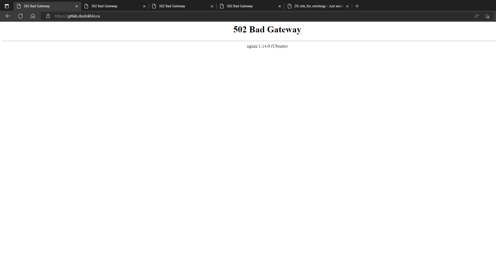

</details>

---

### Установка кластера MySQL

>Необходимо разработать Ansible роль для установки кластера MySQL.
>
>Рекомендации:
>
>- Имена серверов: `db01.you.domain` и `db02.you.domain`
>- Характеристики: 4vCPU, 4 RAM, Internal address.
>
>Цель:
>
>1. Получить отказоустойчивый кластер баз данных MySQL.
>
>Ожидаемые результаты:
>
>1. MySQL работает в режиме репликации Master/Slave.
>2. В кластере автоматически создаётся база данных c именем `wordpress`.
>3. В кластере автоматически создаётся пользователь `wordpress` с полными правами на базу `wordpress` и паролем `wordpress`.
>
>**Вы должны понимать, что в рамках обучения это допустимые значения, но в боевой среде использование подобных значений не
>приемлимо! Считается хорошей практикой использовать логины и пароли повышенного уровня сложности. В которых будут содержаться
>буквы верхнего и нижнего регистров, цифры, а также специальные символы!**

### Решение

Разработана Ansible [роль](ansible/roles/mysql) для установки Mysql

Роль устанавливает MySQL на двух серверах, после этого настроит репликацию.

Проверка корректности происходит автоматом.

```bash
null_resource.playbook (local-exec): TASK [mysql : Checking status of replica replication] **************************
null_resource.playbook (local-exec): skipping: [db01.dsolokhin.ru]
null_resource.playbook (local-exec): ok: [db02.dsolokhin.ru]

null_resource.playbook (local-exec): TASK [mysql : Checking status of primary replication] **************************
null_resource.playbook (local-exec): skipping: [db01.dsolokhin.ru]
null_resource.playbook (local-exec): ok: [db02.dsolokhin.ru -> db01.dsolokhin.ru(192.168.110.12)]
```

___

### Установка WordPress

>Необходимо разработать Ansible роль для установки WordPress.
>
>Рекомендации:
>
>- Имя сервера: `www.you.domain`
>- Характеристики: 4vCPU, 4 RAM, Internal address.
>
>Цель:
>
>1. Установить [WordPress](https://wordpress.org/download/). Это система управления содержимым
>   сайта ([CMS](https://ru.wikipedia.org/wiki/Система_управления_содержимым)) с открытым исходным кодом.
>
>По данным W3techs, WordPress используют 64,7% всех веб-сайтов, которые сделаны на CMS. Это 41,1% всех существующих в мире
>сайтов. Эту платформу для своих блогов используют The New York Times и Forbes. Такую популярность WordPress получил за
>удобство интерфейса и большие возможности.
>
>Ожидаемые результаты:
>
>1. Виртуальная машина на которой установлен WordPress и Nginx/Apache (на ваше усмотрение).
>2. В вашей доменной зоне настроена A-запись на внешний адрес reverse proxy:
>- `https://www.you.domain` (WordPress)
>3. На сервере `you.domain` отредактирован upstream для выше указанного URL и он смотрит на виртуальную машину на которой
>   установлен WordPress.
>4. В браузере можно открыть URL `https://www.you.domain` и увидеть главную страницу WordPress.

### Результат:

<details>

<summary>www</summary>

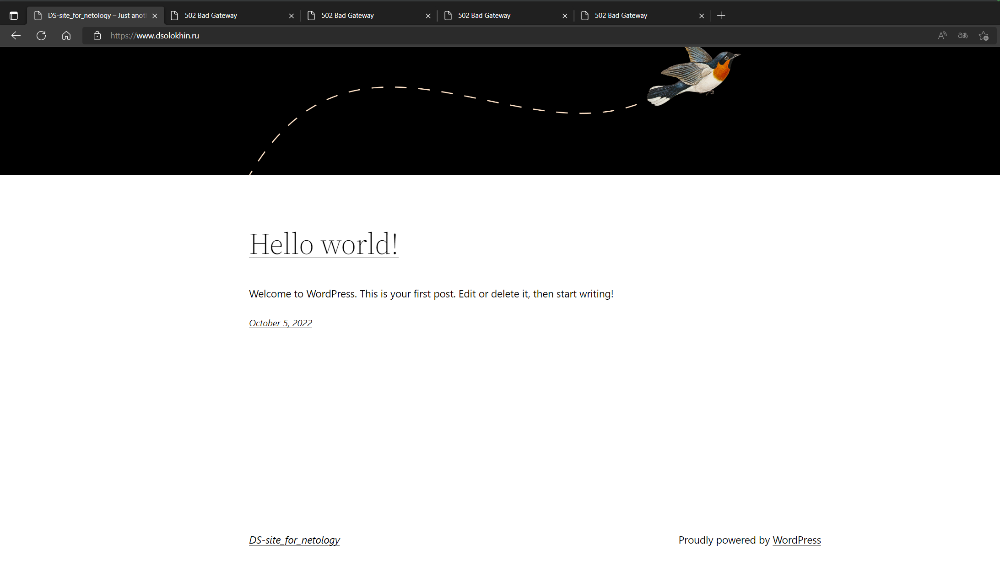

</details>

---

>### Установка Gitlab CE и Gitlab Runner
>
>Необходимо настроить CI/CD систему для автоматического развертывания приложения при изменении кода.
>
>Рекомендации:
>
>- Имена серверов: `gitlab.you.domain` и `runner.you.domain`
>- Характеристики: 4vCPU, 4 RAM, Internal address.
>
>Цель:
>
>1. Построить pipeline доставки кода в среду эксплуатации, то есть настроить автоматический деплой на сервер `app.you.domain`
>   при коммите в репозиторий с WordPress.
>
>Подробнее об [Gitlab CI](https://about.gitlab.com/stages-devops-lifecycle/continuous-integration/)
>
>Ожидаемый результат:
>
>1. Интерфейс Gitlab доступен по https.
>2. В вашей доменной зоне настроена A-запись на внешний адрес reverse proxy:
>    - `https://gitlab.you.domain` (Gitlab)
>3. На сервере `you.domain` отредактирован upstream для выше указанного URL и он смотрит на виртуальную машину на которой
>   установлен Gitlab. 
>4. При любом коммите в репозиторий с WordPress и создании тега (например, v1.0.0) происходит деплой на виртуальную машину.

### Решение

- Разработка/адаптация роли [gitlab](ansible/roles/gitlab)
- Разработка/адаптация роли [runner](ansible/roles/gitlab)


### CI настройка 

1. Создали новый репозиторий  `CI_test`

<details>

<summary>Новый репозиторий</summary>

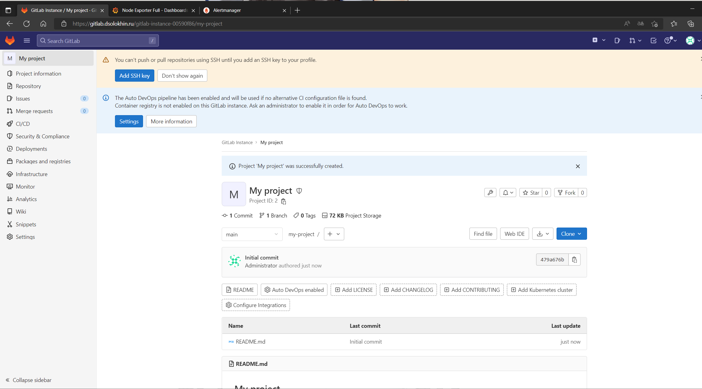

</details>

2. Зададим переменные в проекте GitLab

3. Настроили [.gitlab-ci.yml](CI-gitlab/gitlab-ci.yml)

4. Если есть таг, то происходит передача содержимого на сервер\
Если тага нет, то деплой пропускается

5. Пайплайн

<details>

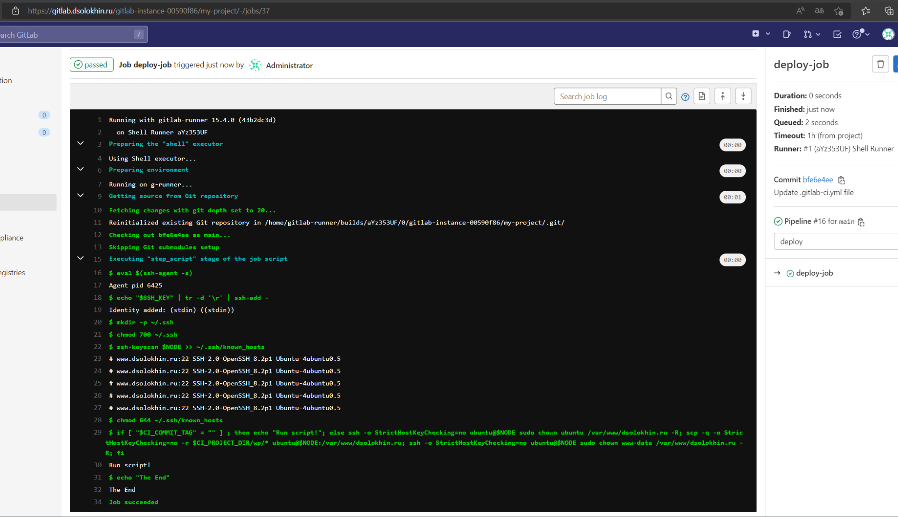

</details>

___

### Установка Prometheus, Alert Manager, Node Exporter и Grafana

> Необходимо разработать Ansible роль для установки Prometheus, Alert Manager и Grafana.
>
> Рекомендации:
>
> - Имя сервера: `monitoring.you.domain`
> - Характеристики: 4vCPU, 4 RAM, Internal address.
>
> Цель:
>
> 1. Получение метрик со всей инфраструктуры.
>
> Ожидаемые результаты:
>
> 1. Интерфейсы Prometheus, Alert Manager и Grafana доступены по https.
> 2. В вашей доменной зоне настроены A-записи на внешний адрес reverse proxy:
>
> - `https://grafana.you.domain` (Grafana)
> - `https://prometheus.you.domain` (Prometheus)
> - `https://alertmanager.you.domain` (Alert Manager)
>
> 3. На сервере `you.domain` отредактированы upstreams для выше указанных URL и они смотрят на виртуальную машину на которой
>    установлены Prometheus, Alert Manager и Grafana.
> 4. На всех серверах установлен Node Exporter и его метрики доступны Prometheus.
> 5. У Alert Manager есть необходимый [набор правил](https://awesome-prometheus-alerts.grep.to/rules.html) для создания
>    алертов.
> 6. В Grafana есть дашборд отображающий метрики из Node Exporter по всем серверам. 
> 7. ~~В Grafana есть дашборд отображающий метрики из MySQL (*).~~ 
> 8. ~~В Grafana есть дашборд отображающий метрики из WordPress (*).~~

*Примечание: дашборды со звёздочкой являются опциональными заданиями повышенной сложности их выполнение желательно, но не
обязательно.*

### Результат

<details>

<summary>Monitoring summary</summary>

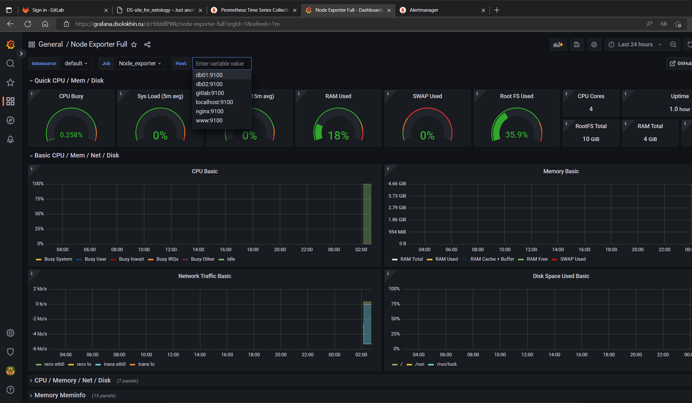

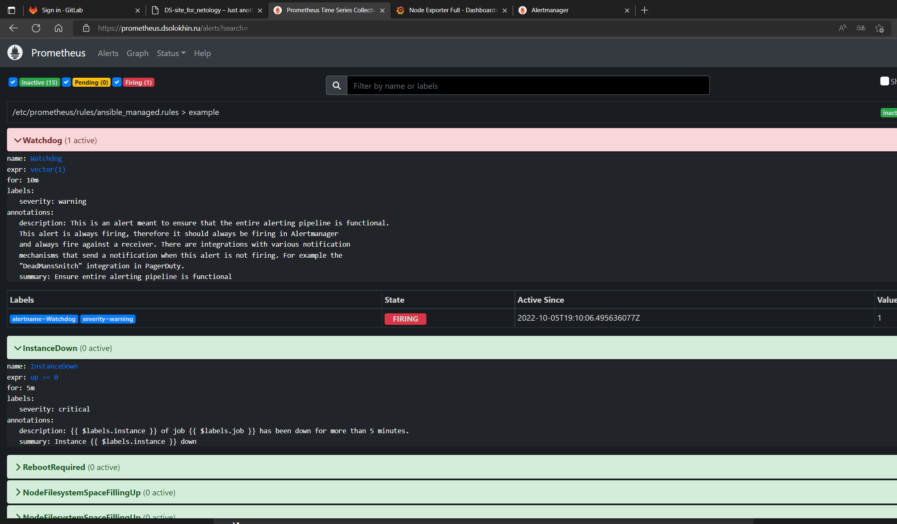

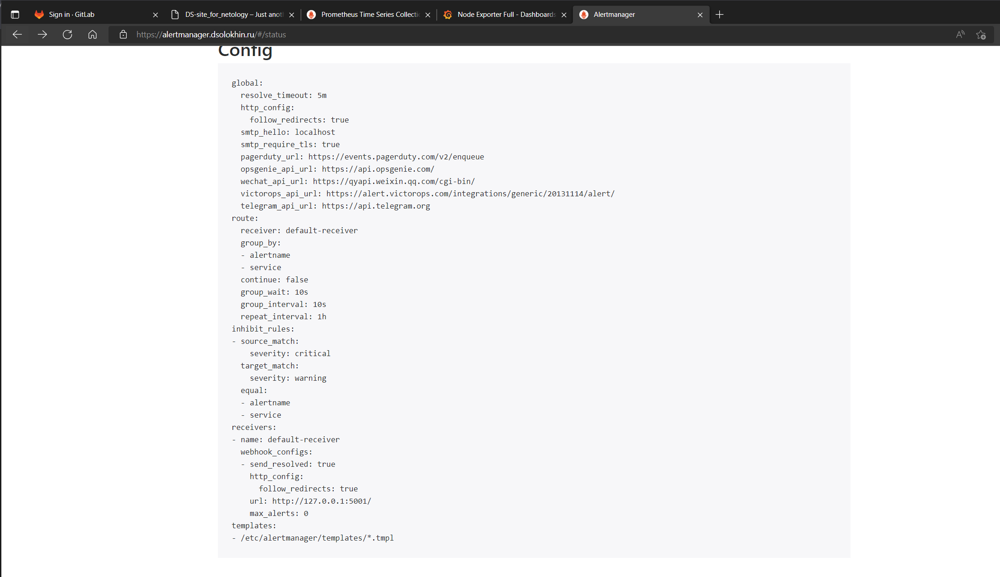
</details>

---

## Что необходимо для сдачи задания?

1. Репозиторий со всеми Terraform манифестами и готовность продемонстрировать создание всех ресурсов с нуля.

Манифесты доступны [тут](terraform)

2. Репозиторий со всеми Ansible ролями и готовность продемонстрировать установку всех сервисов с нуля.

Роли и плейбук доступны [тут](ansible)

3. Скриншоты веб-интерфейсов всех сервисов работающих по HTTPS на вашем доменном имени.

- `https://www.you.domain` (WordPress)

<details>

<summary>Wordpress</summary>


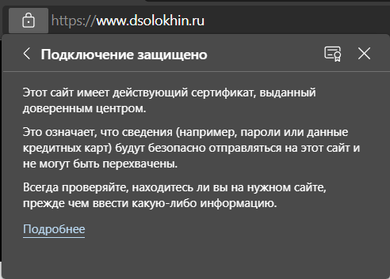
</details>

---

- `https://gitlab.dsolokhin.ru` (Gitlab)


<details>

<summary>Gitlab</summary>

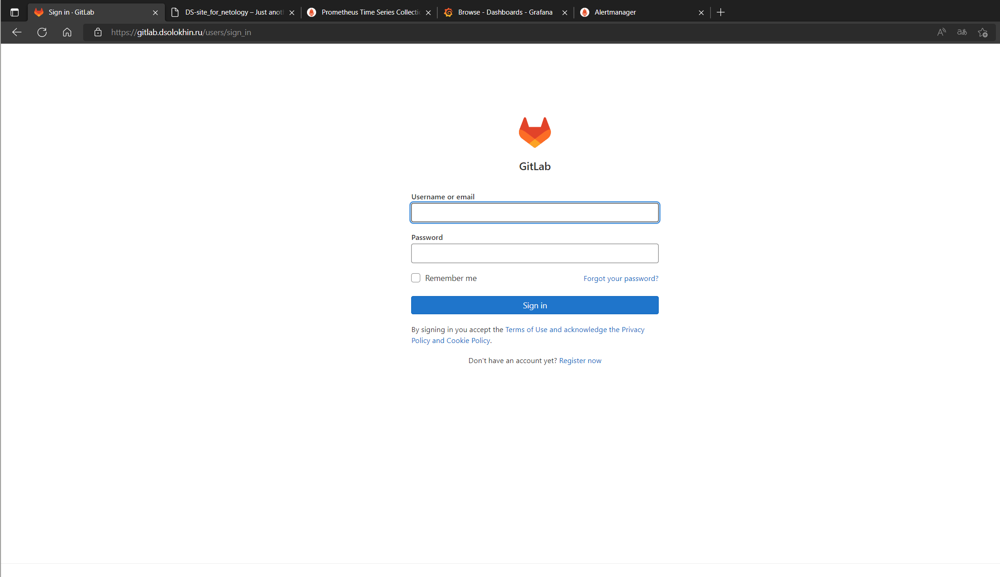
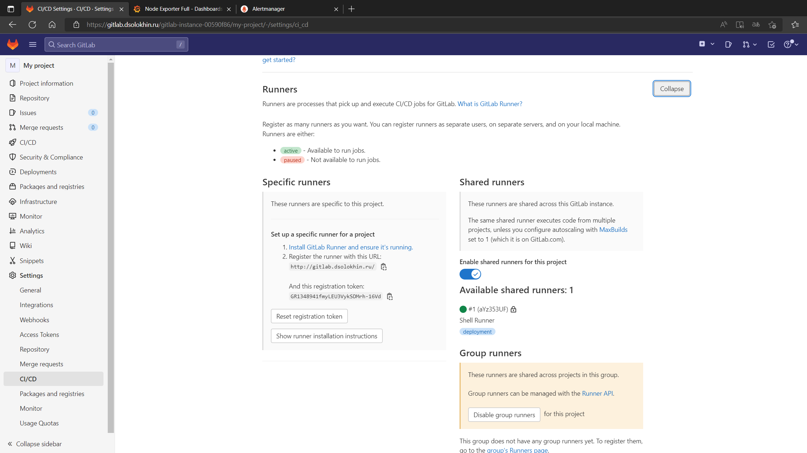
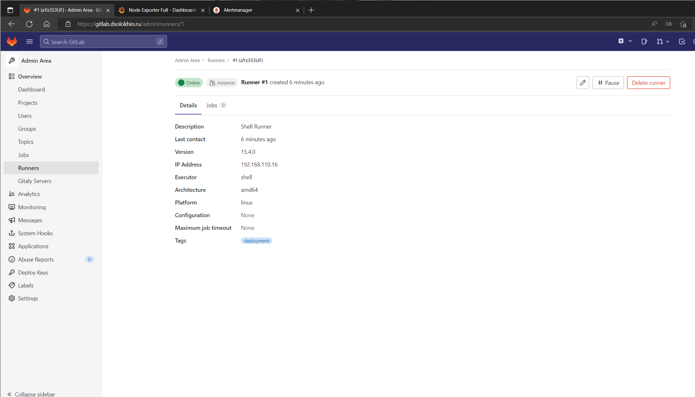

</details>


---

- `https://grafana.dsolokhin.ru` (Grafana)


<details>

<summary>Grafana</summary>

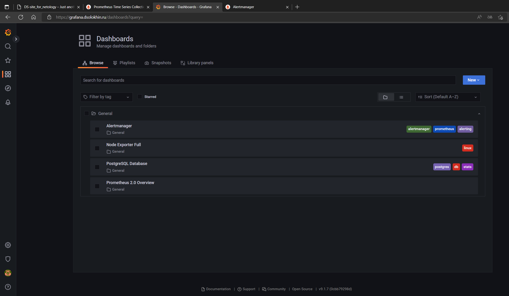

</details>

---

- `https://prometheus.dsolokhin.ru` (Prometheus)

<details>

<summary>Prometheus</summary>

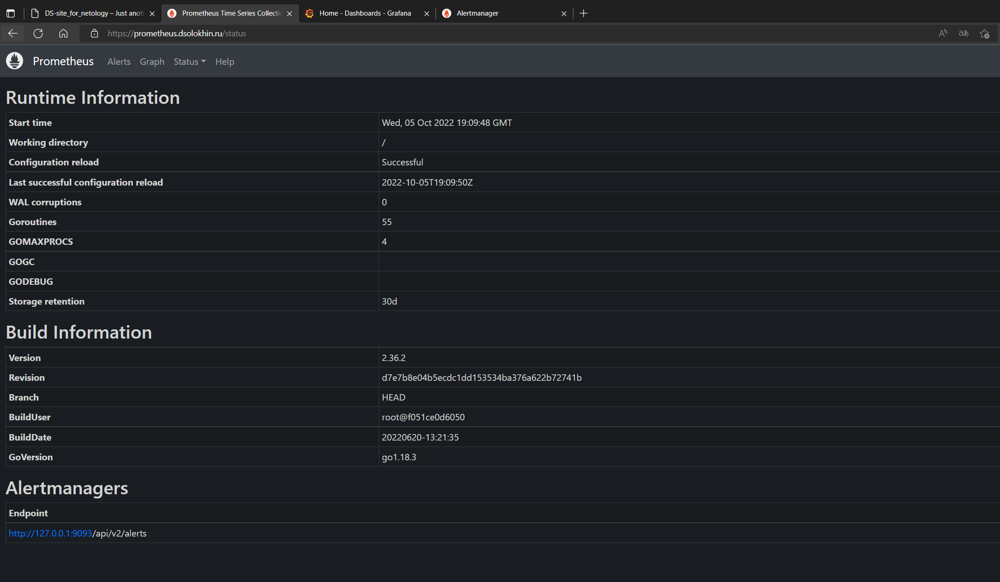

</details>

---

- `https://alertmanager.dsolokhin.ru` (Alert Manager)

<details>

<summary>Alert Manager</summary>

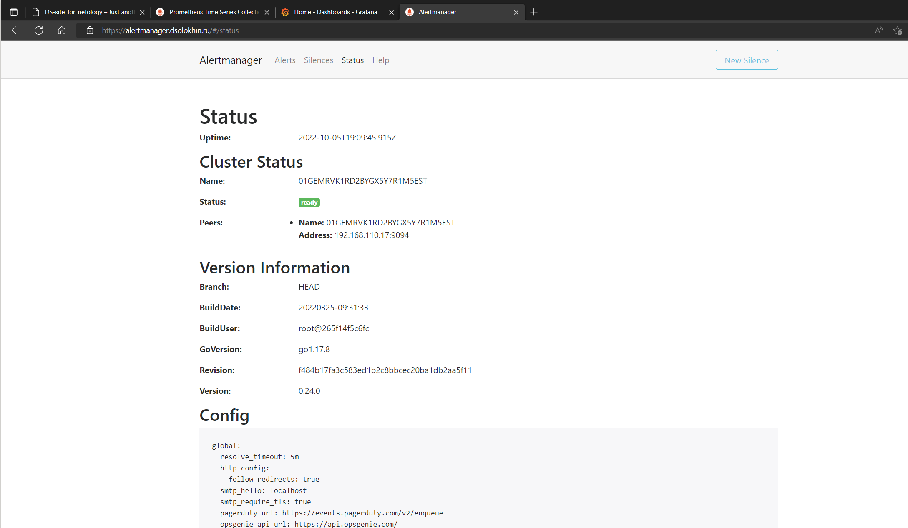

</details>

---

4. Все репозитории рекомендуется хранить на одном из ресурсов ([github.com](https://github.com)
   или [gitlab.com](https://gitlab.com)).
   - https://github.com/DSolokhin/devops-netology/tree/master/Diplom_DS

---

### Уничтожим все что создали

```bash
$ terraform destroy -auto-approve
...........
Destroy complete! Resources: 21 destroyed.
```

----

## Дополнительные сведения 

### Логи

Посмотреть тут [LOGFILE](src/bash.log)

---
